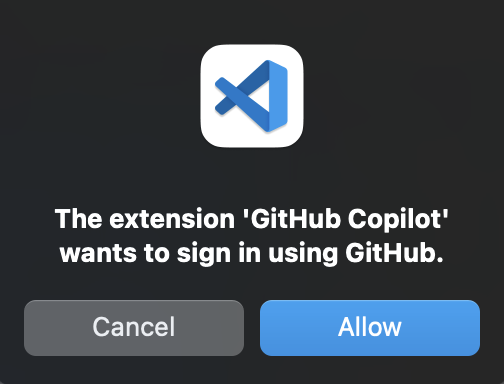
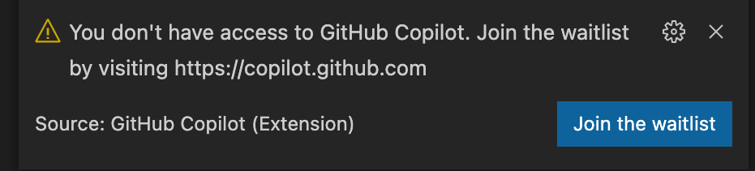
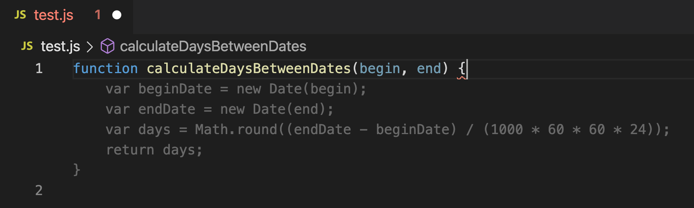
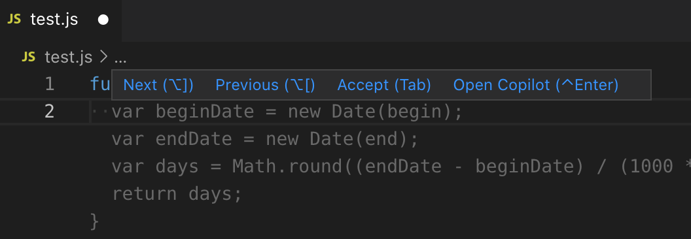
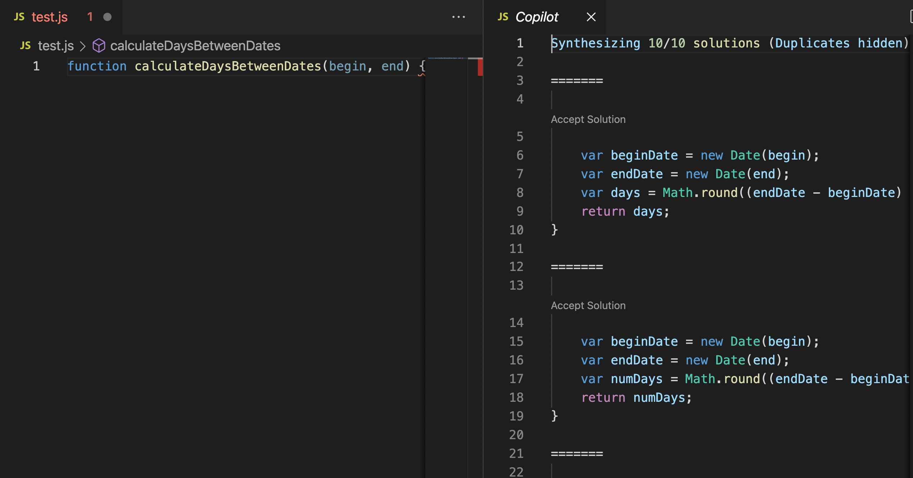
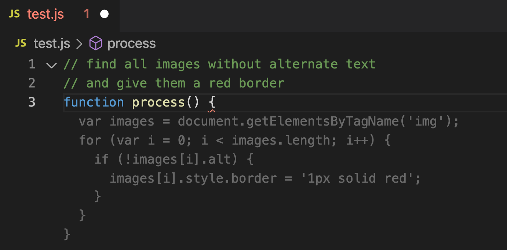

# Getting Started with GitHub Copilot

- [Installing the Visual Studio Code extension](#installing)
- [Seeing your first suggestion](#first-suggestion)
- [Choosing alternate suggestions](#alternates)
- [Getting more suggestions](#more-suggestions)
- [Generating code from a comment](#code-from-comment)
- [Using a framework](#using-a-framework)
- [More examples](#more-examples)
- [Configuring GitHub Copilot](#settings)

<a name="installing"></a>
## 1. Installing the Visual Studio Code extension

To use GitHub Copilot, you first need to install the Visual Studio Code extension.

1. Visit the [GitHub Copilot extension](https://marketplace.visualstudio.com/items?itemName=GitHub.copilot) page on the Visual Studio Code Marketplace and install the extension.
2. Open Visual Studio Code. You will be prompted to authorize the extension by signing in to GitHub.

   </img>

3. After you have authorized the extension, you will be returned back to Visual Studio Code.

If you receive the following message, you have not yet been added to the GitHub Copilot Technical Preview. 
The Technical Preview is open to a limited number of testers. To join the 
waitlist, visit [copilot.github.com](https://copilot.github.com).

</img>

Having problems installing? Visit the [Discussions](https://github.com/github/copilot-preview/discussions) forum.

<a name="first-suggestion"></a>
## 2. Seeing your first suggestion

GitHub Copilot provides completions for a dozens of languages and a wide variety of frameworks, 
but it works especially well for Python, JavaScript, TypeScript, Ruby, and Go. 
The following samples are in JavaScript, but other languages will work similarly.

1. Create a new JavaScript (.js) file.
2. Type the following function header:

   ```javascript
   function calculateDaysBetweenDates(begin, end) {
   ```

3. GitHub Copilot will automatically suggest an entire function body in grayed text, as shown below. 
The exact suggestion may vary.

   </img>

4. Press `Tab` to accept the suggestion.

GitHub Copilot will attempt to match your code's context and style. You can edit the suggested code as you choose.

<a name="alternates"></a>
## 3. Choosing alternate suggestions

For any given input, GitHub Copilot can provide multiple suggestions. 
As the developer you are always in charge; you can select which suggestion to use, or reject them all.

1. Clear the file (or start a new one), and type the following again:

   ```javascript
   function calculateDaysBetweenDates(begin, end) {
   ```

2. GitHub Copilot will again show you a suggested completion.

3. Instead of pressing `Tab`:
   * On macOS, press `Option`+`]` (or `Option`+`[`).
   * On Windows or Linux, press `Alt`+`]` (or `Alt`+`[`).

   GitHub Copilot will cycle through other alternative suggestions.

4. When you see a suggestion you like, press `Tab` to accept it.

5. If you don't like any of the suggestions, press `Esc`.

You can also hover over a suggestion to see the GitHub Copilot command palette for choosing suggestions.

</img>

<a name="more-suggestions"></a>
## 4. Getting more suggestions

Sometimes, the first set of suggestions returned aren't good enough. 
You can ask GitHub Copilot to return more.

1. Clear the file (or start a new one), and type the following again:

   ```javascript
   function calculateDaysBetweenDates(begin, end) {
   ```

2. GitHub Copilot will again show you a suggested completion.

3. Press `Ctrl`+`Enter`. GitHub Copilot will open a new tab and suggest multiple options, as shown below.

   </img>

4. Pick one you like, and accept the suggestion to continue.

5. If you don't like any of the returned suggestions, just close the suggestions tab.

<a name="code-from-comment"></a>
## 5. Generating code from a comment

GitHub Copilot can understand significantly more context than most code assistants, 
and can generate entire functions from something as simple as a comment. 

1. Create a new JavaScript file, and type the following:

   ```javascript
   // find all images without alternate text
   // and give them a red border
   function process() {
   ```

2. GitHub Copilot will automatically suggest an implementation:

   </img>

<a name="using-a-framework"></a>
## 6. Using a framework

GitHub Copilot is especially useful for working with APIs and frameworks you're unfamiliar with.
Here, we'll use GitHub Copilot to create a simple Express server that returns the current time.

1. Create a new JavaScript file, and type the following comment and press `Enter`.

   ```javascript
   // Express server on port 3000
   ```

2. GitHub Copilot will generate lines of code to create the Express app. 
Press `Tab` and `Enter` to accept each line.

3. Type the following comment and press `Enter`.

   ```javascript
   // Return the current time
   ```

4. GitHub Copilot will generate code for the default handler. Press `Tab` to accept each line.

<a name="more-examples"></a>
## 7. More examples

There's a lot more that GitHub Copilot can do. 
Check out the examples on [copilot.github.com](https://copilot.github.com) to see more, 
or the [Gallery](https://github.com/github/copilot-preview/tree/main/gallery) in 
this repository for the latest examples from us and the community.

Got an example of your own? We welcome you to share it on our [Discussions](https://github.com/github/copilot-preview/discussions) forum.

<a name="settings"></a>
## 8. Configuring GitHub Copilot

To configure GitHub Copilot's basic settings, open a [Visual Studio Code settings](https://code.visualstudio.com/docs/getstarted/settings) tab, 
and navigate to the GitHub Copilot extension section. You can set the following settings in the dialog:

* **Inline Suggestions : Enable** (`github.copilot.inlineSuggest.enable`)<br />
  Turns inline suggestions on or off.

* **Inline Suggestions : Count** (`github.copilot.inlineSuggest.count`)<br />
  Configures the maximum number of inline suggestions to fetch.

* **Autocomplete: Enable** (`github.copilot.autocomplete.enable`)<br />
  Turns the suggestions pane on or off.

* **Autocomplete: Count** (`github.copilot.autocomplete.count`)<br />
  Configures the maximum number of suggestions to fetch for the suggestions pane.

* **Languages** (`github.copilot.enable`)<br />
  Configure the languages that are enabled for GitHub Copilot.
  This string is of the form<br /> 
  `{ "python": true, "markdown": false, ...}`.
